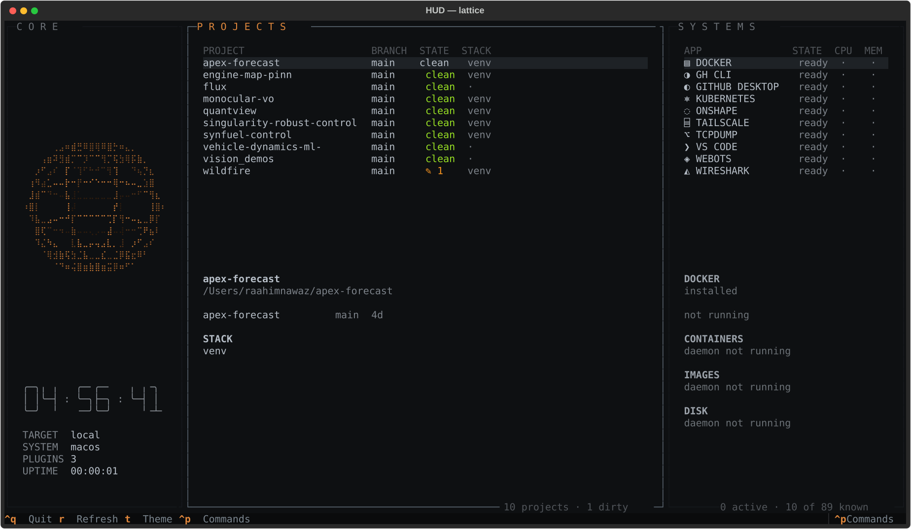

# HUD

A systems console for engineering work. Not an app launcher — a single surface
that holds the state of your projects, the processes running on your machine,
and the hardware designs in your repos, and lets you act on all three without
leaving the keyboard.



```bash
uvx hud-console          # try it
uv tool install hud-console
```

---

## What it actually solves

### Non-blocking async execution

The rendering loop is never allowed to stall. Every data source — `git status`
across ten repos, a process table scan, a `docker ps`, a schematic parse — runs
in a Textual Worker on its own interval, over `asyncio.create_subprocess_exec`,
under a bounded semaphore. The UI thread only ever composites.

This is enforced structurally, not by convention: plugins return `Action`
objects and never touch a subprocess themselves, so there is no path by which a
slow provider can reach the render path.

Measured on an M-series Mac:

| State | CPU (one core) |
|---|---|
| Visible, sphere animating at 20fps | **15–19%** |
| Visible, sphere disabled | **1.7%** |
| Hidden behind the hotkey | **0.6%** |

Both the animation and every plugin timer stop on `AppBlur` and resume with an
immediate refresh on `AppFocus` — the console spends most of its life hidden,
and polling for data nobody is reading is the one genuinely wasteful thing it
could do. Finding that number is also what surfaced a feedback loop where
redrawing a table re-emitted its own selection event: **27 polls in 5 seconds
against a 5-second interval.**

### Hardware automation — direct schematic parsing

`.kicad_sch` and `.kicad_pcb` are read **directly**, via a purpose-built
S-expression reader (`hud/plugins/hardware/sexpr.py`). No `kicad-cli`, no
subprocess, no GUI toolkit load — and critically, **no KiCad installation
required**. The machine reviewing a design is often not the machine that
authored it.

Selecting a project with a schematic in it gives you an orderable BOM inline:

```
BOM  1 unfootprinted   7 parts · 5 unique · 2 sheet(s)
    2× 100nF              C1, C2
    2× 10k                R1, R2
    1× 4k7 "precision"    R10
    1× AMS1117-3.3        U2
    1× STM32F405RGTx      U1
  missing footprints: U1
```

The parser handles the cases that make the difference between a BOM you can
order from and one an assembler bounces:

- **Hierarchical sheets are followed** — a BOM covering only the root sheet is
  worse than no BOM.
- **The root sheet is resolved structurally** — it is the sheet no other sheet
  references. Filesystem order is not a guide, and picking wrong silently
  produces a BOM for a fragment of the board.
- **Power symbols (`#PWR`, `#FLG`) are excluded** — annotations, not parts.
- **`lib_symbols` definitions are excluded** — library entries are not instances.
- **Manufacturing readiness is one flag**: every part has a footprint, or it
  names the ones that don't.

### Project workspaces

A project bundles repos, apps, containers, and sim/PCB files, so "start working
on the gesture bot" is one action instead of six windows. Every git repo becomes
a project automatically, with capabilities read off disk — `install/setup.bash`
means ROS 2, `docker-compose.yml` means containers, `worlds/*.wbt` means Webots.
`projects.yaml` exists to override or combine, never to get started.

`Engage` composes the launch, including the thing that trips people up: a ROS 2
overlay can only be sourced *by the shell that will use it*, so it goes on the
launched shell's command line, not into a background step.

### Process telemetry

Per-process CPU, RSS, thread count, and uptime for every tracked application,
sampled from cached `psutil.Process` handles so `cpu_percent()` reports a real
delta rather than `0.0` forever. Plus declarative per-app probes in YAML:

```yaml
inspect:
  - { label: CONTAINERS, exec: [docker, ps, --format, "{{.Names}} {{.Status}}"],
      parse: lines, max: 6, empty: "none running" }
  - { label: IMAGES, exec: [docker, images, -q], parse: count }
```

Probes run for the **selected** app only. A dead daemon renders
`daemon not running`, never a traceback — degradation is a first-class state.

---

## Architecture

The design rests on one decision: **`Host` (where a command runs) and
`Platform` (how it is expressed) are orthogonal.**

```
Host        LocalHost | SSHHost         — the transport
Platform    MacOS | Linux | Windows     — the command vocabulary
Target      = (Host, Platform)
```

The same three platform backends serve "run it here" and "run it on the
workstation over SSH", so portability and remote control are not two projects.

Every side effect is an `Action` carrying a `Danger` level, and confirmation
scales with it — with the target host always named:

| Danger | Examples | Gate |
|---|---|---|
| `SAFE` | launch, open editor | runs immediately |
| `CAUTION` | graceful quit, sleep, compose up | single `y` |
| `DESTRUCTIVE` | force-kill, compose down, shut down | type `CONFIRM` |
| `DESTRUCTIVE` + remote | shut down another host | **type the host alias** |

> Terminals report key *press*, never key *release*. A hold-to-confirm gesture
> would depend on the user's key-repeat settings — fragility you do not want
> guarding a shutdown. Typing cannot be triggered by a stuck key.

Graceful quit is always a separate action from force-kill and never silently
escalates. On macOS, power verbs route through System Events rather than `sudo
shutdown`, so apps are asked to quit, save dialogs still appear, and **the
console never handles a password.**

### SSH

The security property is what it refuses to do: it never prompts for, parses,
stores, or transmits a credential. It shells out to the system `ssh` with a
`~/.ssh/config` alias and lets OpenSSH authenticate against your agent.
`hosts.toml` holds an alias string and nothing else. `ControlMaster`
multiplexing is mandatory, not an optimization — a polling TUI would otherwise
pay a full handshake per refresh. `allow_power` defaults to **false** per host.

### The catalogue

~90 engineering tools across CAD, EDA, robotics, embedded, networking, CAE, ML,
numerical, vision, fabrication, and dev. Absent tools are hidden but stay
loaded, so installing something later makes it appear on the next refresh.
Adding one is a few lines of YAML and no Python:

```yaml
- id: kicad
  platforms:
    macos:  { detect: { bundle: /Applications/KiCad/KiCad.app },
              launch: { open: /Applications/KiCad/KiCad.app } }
    linux:  { detect: { which: kicad }, launch: { exec: [kicad] } }
```

---

## Status

**Verified on macOS:** 17/17 end-to-end checks, including that a cancelled
shutdown confirm executes nothing at all, and 9/9 schematic-parser checks
against a hierarchical fixture.

```bash
uv run pytest        # 16 tests, no KiCad or network required
```

**Not implemented — do not read the sections above as claiming these:**

- **GPU / VRAM telemetry.** There is no `nvidia-smi` on Apple Silicon, so this
  is inherently remote. A catalogue entry shells `nvidia-smi --query-gpu` but
  has never been run.
- **Docker socket streaming.** Container data comes from the `docker` CLI, not
  the socket. Fine at a 5-second interval; not "streaming".
- **`SSHHost`** is implemented but untested against a live remote.
- **Linux and Windows platform backends** are written against documented
  behaviour and have not been run on real hosts.
- **Gerber export / manufacturing packaging.**
- **In-console project creation** — projects are auto-derived or declared in
  YAML; there is no creation form.
- **The demo GIF.** `demo.tape` is ready; `brew install vhs && vhs demo.tape`.

---

## Next steps

Ordered by what unblocks the most, not by what is easiest.

### 1. SSH against a live host

Everything remote is gated behind this, and it is the single biggest gap
between what the architecture supports and what has actually been run.
`SSHHost` and the `Host` × `Platform` seam exist; what is missing is a real
target. On the reference setup that means `sshd` inside WSL 2 plus Tailscale —
Tailscale specifically, because WSL 2 sits behind NAT and the alternative is a
`netsh interface portproxy` rule and a forwarded router port, which is worse
security for more work.

Done when: `ssh workstation true` returns in <20ms warm under `ControlMaster`,
a remote host appears in the console, and shutting it down marks it `OFFLINE`
cleanly instead of raising.

### 2. Remote GPU telemetry

Directly unblocked by (1), and what makes the "unified compute telemetry" claim
honest rather than aspirational. `nvidia-smi --query-gpu=utilization.gpu,
memory.used,memory.total --format=csv,noheader` over a multiplexed connection,
sampled on its own interval, plotted as a braille sparkline. The point is
watching VRAM when a sim workload launches — which is exactly the case that
cannot be measured locally on Apple Silicon.

### 3. Gerber export and manufacturing preflight

The BOM half of the hardware pipeline is done; this is the other half. Export
via `kicad-cli pcb export gerbers` when KiCad is present, zip the output, and
run a preflight against the board summary already parsed from `.kicad_pcb` —
copper layer count, unfootprinted parts, missing drill file. Unlike BOM
extraction this genuinely needs KiCad installed, because Gerber generation is
not something to reimplement.

### 4. Docker via the socket

Replace CLI polling with the Unix socket, so container state streams rather
than being sampled every five seconds. Also removes a process spawn per probe.
Worth doing after (1) so the same code path serves a remote Docker host.

### 5. Verify Linux and Windows

The platform backends are written and unexercised. Each needs one session on a
real host confirming power verbs, process enumeration, and app detection. Until
then they should be treated as untested code that happens to compile.

### 6. In-console project creation

Projects are auto-derived or hand-written in YAML today. A creation form —
name, root, pick repos, pick apps, pick containers — closes the loop so the
console can define work as well as display it.

### 7. Test coverage beyond the parser

The schematic parser has real tests because it is pure and machine-independent.
The async layer, the confirmation gates, and the catalogue currently rely on
end-to-end scripts run by hand. The confirmation gates in particular deserve
committed tests — "a cancelled shutdown executes nothing" is the one property
where a regression is unacceptable.

## Keys

| Key | Action |
|---|---|
| `ctrl+p` | command palette — everything lives here |
| `r` | refresh all |
| `t` | cycle theme (`lattice`, `gotham`, `arc-reactor`, `matrix`) |
| `ctrl+q` | quit |

Global hotkey `Ctrl+F+U` via Hammerspoon (`scripts/install-macos.sh`). `Ctrl`
is a modifier but `F` and `U` are both ordinary keys, so a three-key chord needs
a raw event tap; the tap holds `Ctrl+F` for 400ms and replays it if `U` never
arrives, so readline's forward-char and kill-line both still work.
